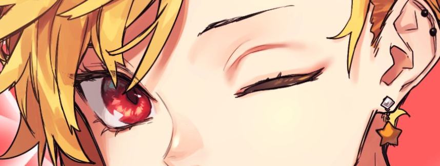

# ascii-art-braille-chars (depreceated)

New version: [img2ascii](https://github.com/HTsuyoshi/img2ascii)

## Welcome

To full-fill my personal desires (put waifus in my shell) I created this img to UTF-8 converter.

It's a python script that get an image and transform into ascii-art.

## Usage

### Example (Local)

```sh
./asciiArt image.jpg -s=500 -t=90
```

### Example (Docker)

Build:

```sh
make build
```

Run:

```sh
./run-docker.sh image.jpg -s=500 -t=90
```

## Requirements (python library)

### Local

- numpy
- PIL

### Docker

- docker

## Usage
```
asciiArt filePath
```

## Preview

Threshold: 100


⢉⣽⣿⣿⡿⠛⠡⣿⣿⣿⠟⢫⣶⣿⣿⡿⢋⡔⢺⣿⢧⣿⣿⣿⣿⣿⣿⣿⢿⣿⣿⣿⣿⣿⣿⣿⣿⣿⣿⣿⣿⣏⡆⠐⣰⣿⣿⣮⠳⠁
⣿⠿⢛⣽⣤⡆⣿⣿⣿⡏⣠⢸⣿⣿⢫⡶⢋⢡⣿⣏⣾⣿⣿⣟⣭⣽⣶⣾⣿⣿⣿⣿⣿⣿⣿⣿⣿⣿⣿⣿⣿⣿⡢⣠⣿⣿⣿⣿⣷⢠
⠀⢠⣾⣿⣿⣷⣿⣿⣿⠐⡸⣾⣿⣿⠼⣺⣗⣿⣿⣾⣿⣿⣿⣿⣿⣿⣿⣿⣿⣿⣿⣿⣿⣿⣿⣿⣿⣿⣿⣿⣿⣿⣅⣿⣟⡿⣿⣿⣿⣾
⣠⣾⣿⣹⣿⣿⣿⣿⡟⠰⠿⠌⢿⢛⢹⡟⣽⣿⣿⣿⣿⣿⣿⣿⣿⣿⣿⣿⣿⣿⣿⣿⣿⣿⣿⣿⢿⣿⣿⣿⣿⣿⣿⣿⢗⣿⣿⣿⣿⢏
⣿⠟⣿⠋⣿⣿⣼⣿⡀⢠⣤⡄⠀⠀⠈⠜⢿⣿⣿⣿⣿⣿⣿⣿⣿⣿⣿⣿⠿⠛⠋⠉⢉⣁⣠⣤⣾⣿⣿⣿⣿⣿⣿⣿⣻⣿⣿⢟⣵⣿
⣿⣷⣿⢠⢸⣿⣿⣿⡇⣌⣿⣇⠀⣄⠀⠀⡀⣹⣿⣿⣿⣿⣿⣿⣿⣿⣿⣴⣶⣿⣿⣿⣿⣿⣿⣿⣿⣿⣿⣿⣿⣿⣿⣿⣿⠟⣱⣿⣿⣿
⣿⣿⡇⢸⡎⣿⣿⣿⡇⠈⢟⡻⣷⣿⠛⠘⣁⣿⣿⣿⣿⣿⣿⣿⣿⣿⣿⣿⣿⣿⣿⣿⣿⣿⣿⣿⣿⣿⣿⣿⣿⣿⢫⡅⢸⢻⣼⣿⣿⣿
⣿⡟⣼⣄⠧⢻⢿⣷⡄⠀⠘⣿⣾⣴⣶⣿⣿⣿⣿⣿⣿⣿⣿⣿⣿⣿⣿⣿⣿⣿⣿⣿⣿⣿⣿⣿⣿⣿⣿⣿⣿⢃⣦⠐⠇⢨⣿⣿⣿⣿
⢋⣜⣫⣷⡆⣜⠀⠛⠿⣄⠀⠸⣿⣿⣿⣿⣿⣿⣿⣿⣿⣿⣿⣿⣿⣿⣿⣿⣿⣿⣿⣿⣿⣿⣿⣿⣿⣿⣿⣿⡟⣼⣿⡄⢶⣾⣿⣿⣿⣿
⡶⠂⠀⠀⢀⣤⣞⠀⠀⠀⣠⡔⠉⠀⠀⢀⡴⢫⡅⠀⡘⠀⠀⠀⠀⠀⠀⠀⡀⠀⠀⠀⠀⠀⠀⠀⠀⠀⠀⠀⠀⠰⢱⣫⠎⠀⠀⠑⣌⣾
⠀⣀⡤⠂⠛⢹⠀⠀⠀⢰⠟⡇⠀⠀⡔⢉⡤⡞⠀⠰⠁⠀⠀⠠⠒⠂⠈⠁⠀⠀⠀⠀⠀⠀⠀⠀⠀⠀⠀⠀⠀⠀⢝⠟⠀⠀⠀⠀⠈⡟
⣿⡟⠁⠀⠀⠈⠀⠀⠀⣯⠇⠁⠀⠀⣃⠅⠨⠀⠀⠁⠀⠀⠀⠀⠀⠀⠀⠀⠀⠀⠀⠀⠀⠀⠀⠀⠀⠀⠀⠀⠀⠀⠺⠀⠠⢀⠀⠀⠀⠁
⠟⠀⠀⠆⠀⠀⠀⠀⢠⣏⣀⣳⡀⡤⡆⢠⠀⠀⠀⠀⠀⠀⠀⠀⠀⠀⠀⠀⠀⠀⠀⠀⠀⠀⠀⠀⡀⠀⠀⠀⠀⠀⠀⠀⡨⠀⠀⠀⠀⡰
⠀⣠⠀⣴⠀⠀⠃⠀⢿⡟⠛⢻⣿⣿⣷⣣⡀⠀⠀⠀⠀⠀⠀⠀⠀⠀⠀⠀⣀⣤⣴⣶⡶⠾⠟⠛⠁⠀⠀⠀⠀⠀⠀⠀⠄⠀⠀⡠⠊⠀
⠀⠈⠀⡟⡇⠀⠀⠀⢸⠳⠀⠸⣿⠻⣿⣿⢿⠆⠀⠀⠀⠀⠀⠀⠀⠀⠀⠋⠉⠀⠀⠀⠀⠀⠀⠀⠀⠀⠀⠀⠀⠀⠀⠀⠀⣠⠎⠀⠀⠀
⠀⠀⢰⡇⢱⠀⠀⠀⢸⣷⡠⢄⠈⠀⢤⣧⠾⠀⠀⠀⠀⠀⠀⠀⠀⠀⠀⠀⠀⠀⠀⠀⠀⠀⠀⠀⠀⠀⠀⠀⠀⠀⡔⢺⡇⡄⠃⠀⠀⠀
⠀⢠⠃⠻⡘⡀⡀⠈⢻⣿⣧⠀⠁⠋⠉⠀⠀⠀⠀⠀⠀⠀⠀⠀⠀⠀⠀⠀⠀⠀⠀⠀⠀⠀⠀⠀⠀⠀⠀⠀⠀⡼⠙⣯⣸⡗⠀⠀⠀⠀
⡴⠣⠔⠈⢸⠣⣿⣤⣀⠻⣿⣇⠀⠀⠀⠀⠀⠀⠀⠀⠀⠀⠀⠀⠀⠀⠀⠀⠀⠀⠀⠀⠀⠀⠀⠀⠀⠀⠀⠀⢠⠃⠀⢻⡉⠁⠀⠀⠀⠀


Threshold: 80


⠀⠀⠀⠀⠀⠀⠀⠀⠀⠀⠙⢀⣿⣿⣿⠃⣼⣷⢹⣿⣿⣿⣧⢸⣿⣿⣼⣽⣿⢸⣿⣿⣿⣿⣿⣿⣿⣿⣶⣍⡛⠿⣿⠋⠀⠀⠀⠀⠀⠀
⠀⠀⠀⠀⠀⠀⠀⠀⠀⠀⡀⠠⠉⠻⢡⣾⣿⣿⡆⢿⣿⣿⣿⠈⣿⡇⣿⣧⢻⡿⣿⣿⣿⣿⣿⣻⣿⣿⣿⣿⣿⣷⣦⣄⣀⠀⠀⠀⠀⠀
⠀⠀⠀⠀⠀⠀⠀⠀⠤⠛⠀⠀⠂⣴⣝⢿⣿⣿⣿⡌⣿⣿⣿⡇⢹⢳⣿⣿⣷⡁⢿⣿⣿⣿⣿⣿⣿⣭⡛⠻⠿⢿⣿⣿⣿⣿⣷⣶⣶⣤
⠀⠀⠀⠀⠀⠀⠸⣿⠻⠀⢀⣤⣤⡌⠙⢷⣝⣿⣿⣿⡌⠍⠉⠳⠈⠘⣟⣿⣿⣿⣜⣿⣿⣿⣿⣿⣿⣿⡇⠀⠀⠀⠀⠀⠈⠉⣿⣭⣍⡀
⠀⠀⠀⠀⠀⠀⠀⠉⣤⢾⣿⣿⣷⡀⢰⣤⢹⣾⣿⣿⣿⣆⠀⠀⠀⠸⡿⠟⠛⠛⠋⠉⠉⠀⠀⠀⡙⢿⡇⠀⠀⠀⠀⠀⠀⠀⢻⣿⠏⠀
⠀⠀⠀⠀⠀⠀⠀⠀⠘⠿⣿⣿⣿⣟⣶⣬⣼⣿⣿⣿⣿⣿⣷⣄⠀⠀⢿⣅⣤⣶⡛⢂⣤⣤⢀⣼⣧⣾⣿⡀⠀⠀⠀⠀⠀⠀⠘⠃⠀⠀
⠀⠀⠀⠀⠀⠀⠀⠀⠀⠀⢻⣿⣿⣿⣿⣿⣿⣿⣿⣿⣿⣿⣿⣿⣷⣄⠘⣿⣿⣿⣿⣦⣭⣵⣿⣿⣿⣿⣿⣧⠀⠀⠀⠀⠀⠀⠀⠀⠀⠀
⠀⠀⠀⠀⠀⠀⠀⠀⠀⠀⠈⣿⣿⣿⣿⣿⣿⣿⣿⣿⣿⣿⣿⣿⣿⣿⣷⣜⣿⣿⣿⣿⣿⣿⣿⣿⣿⣿⣿⣿⠀⠀⠀⠀⠀⠀⠀⠀⠀⠀
⠀⠀⠀⠀⠀⠀⠀⠀⠀⠀⠀⢹⣿⣿⣿⣿⣿⣿⣿⣿⣿⣿⣿⣿⣿⣿⣿⣿⣿⣿⣿⣿⣿⣿⣿⣿⣿⣿⣿⡇⠀⠀⠀⠀⠀⠀⠀⠀⠀⠀
⣿⣿⣿⣿⣿⣿⣿⣿⣿⣧⣄⡟⠀⠀⠀⣼⠃⠈⡆⠀⠀⠀⠈⡇⠀⠀⠀⠀⠀⡇⠀⠀⠀⠀⠀⠀⠀⠀⠉⠲⢤⣀⠀⣀⣴⣾⣿⣿⣿⣿
⣿⣿⣿⣿⣿⣿⣿⣿⣿⣿⢾⣟⣶⣄⡜⠁⠀⠀⢱⡀⠀⠀⠀⣷⠀⢸⠀⠘⡄⢀⠀⠀⠀⠀⠀⠄⠀⠀⠀⠀⠀⠈⠙⠺⠿⣿⣿⣿⣿⣿
⣿⣿⣿⣿⣿⣿⣿⣿⣛⣤⣾⣿⣽⠋⠢⡀⠀⠀⠀⢣⠀⠀⠀⢸⡄⡄⠀⠀⠈⢜⡀⠀⠀⠀⠀⠀⠀⠒⢤⣄⣀⡀⠀⠀⠀⠀⠈⠉⠉⠛
⣿⣿⣿⣿⣿⣿⣇⠀⣄⣿⡿⠛⠛⢳⣦⡈⠢⠀⠀⠀⢳⣠⡠⣈⣷⣧⠠⠀⠀⠀⠣⠀⠀⠀⠀⠀⠀⠀⢸⣿⣿⣿⣿⣿⣷⣶⠀⠒⠲⢾
⣿⣿⣿⣿⣿⣿⣿⣶⠛⡁⠀⠀⠈⢿⡏⠛⡆⠁⠀⠀⠀⠹⣿⣿⣿⣇⢀⣠⣤⣤⣴⣶⣶⣿⣿⣿⢦⡀⢸⣿⣿⣿⣿⣿⣿⣿⡄⠀⣰⣿
⣿⣿⣿⣿⣿⣿⣿⣿⣧⣀⠀⠀⠀⠠⠉⠓⠃⠀⠀⠀⠀⠀⠈⠻⣿⣿⡀⠺⠛⠉⢤⡽⠛⠛⡿⠃⠘⠁⠀⢿⣿⣿⣿⣿⣿⣿⣧⣼⣿⣿
⣿⣿⣿⣿⣿⣿⣿⣿⣿⣿⡄⠀⠀⠀⠀⠀⠀⠀⠀⠀⠀⠀⠀⠀⠈⠻⣧⠀⠀⠀⠀⠙⠒⠊⠀⠀⠀⠀⠀⠘⣿⣿⣿⣿⣿⣿⣿⣿⣿⣿
⣿⣿⣿⣿⣿⣿⣿⣿⣿⣿⣷⠀⠀⠀⠀⠀⠀⠀⠀⠀⠀⠀⠀⠀⠀⠀⠈⠣⠀⠀⠀⠀⠀⠀⠀⠀⠀⠀⠀⠀⣿⣿⣿⣿⣿⣿⣿⣿⣿⣿
⣿⣿⣿⣿⣿⣿⣿⣿⣿⣿⣿⡆⠀⠀⠀⠀⠀⠀⠀⠀⠀⠀⠀⠀⠀⠀⠀⠀⠀⠀⠀⠀⠀⠀⠀⠀⠀⠀⠀⢸⣿⣿⣿⣿⣿⣿⣿⣿⣿⣿
